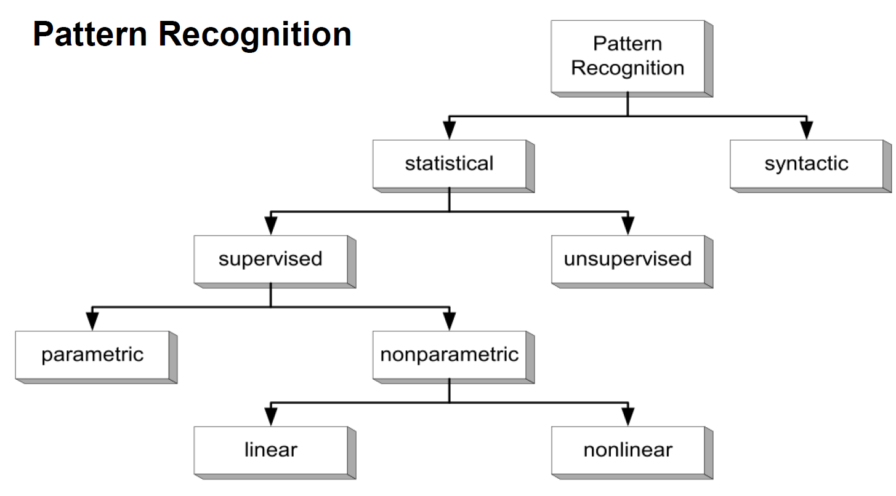
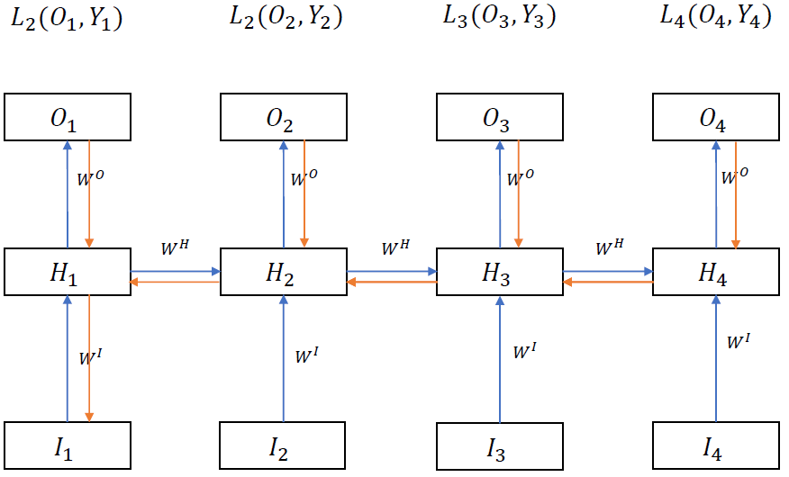

# Deep Learning and Neural Networks

---

    Disclaimer: No guarantee for correctnes or completeness. No official summary. Figures from the lecture. 

---

# 02/03 - Classification 1+2
First some primitive/ old methods for classification, then some based on NNs and Deep Learning (DL).

Overview:

## Correlation-based => Template matching

### Cross Correlation
* 2 dimensional Cross-Correlation:

    $R_{(f,g)}(m, n) = \sum_i \sum_j f(i, j) * g(i-m, j-n)$
* 1 dimensional correlation respectively
* Autocorrelation = Cross correlation with itself

CC mostly is used to get a notion of normality.

### Template Matching

* Idea: Compare new patter to already known pattern, the template.
* **Similarity** $M_{(f,g)}(m,n)$ = Cross-Correlation between the two patterns m and n
* **Distance** E_{(f,g)}(m,n)= Square of Cross-correlation

=> Basically the same as folding a filter over a raster.

#### Problems
  * Cannot learn classification
  * Does not generalize well
  * Has to have a template for each class

#### Workarounds:
  * Normalisation
    * e.g. brightness
    * normalise axes through time non-linearly ("time warping")

## Parametric Classification
---

### Bayes Decision Theory

Datum $x$, class $w_j$

* A priori probability      $P(w_j)$
* A posteriori probability  $P(w_j|x)$
* Class-conditional probability $P(x|w_j)$

Bayes Rule: $P(w_j|x) = \frac{P(x|w_j) * P(w_j)}{P(x)}$

Decision rule: $P(w_j |x) > P(w_i|x)$ => choose $w_j$

$P(w_i | x) = \frac{P(x|w_i) * P(w_i)}{\sum_{j=1}^c P(x|w_j) * P(x)}$

=> decision: 

$P(x| w_j)*P(w_j) > P(x | w_i) * P(w_i)$ => $w_j$

    Common assumption: $p(x | w_i)$ is distributed according to a multivariate normal density

### Risk and Minimum Error Classification
* Choose class of lower risk <=> choose class that maximises posterior probability!

**Likelyhood Ratio**:

$\frac{p(x | w_q)}{p(x | w_2)} > \frac{\lambda_{12} - \lambda_{22}} {\lambda_{21} - \lambda_{11}} * \frac{P(w_1)}{P(w_2)}$

### Gaussian Mixture Classification

$\sum_i$ = covariance matrix

$\eta _i$ = mean vector

### Principal Component Analysis

### The curese of Dimensionality

## Non-parametric classification
---
* Parzen Window
* K-nearest neighbours
* Linear discriminants (general)
* Fisher-Linear Discriminant

### The Perceptron

Classification: 

$g(x) < 0$ => Class A
$g(x) > 0$ => Not class A
$g(x) = 0$ => No decision

Where g(x) is:

$g(x) = \sum_{i=1}^n w_i*x_i + w_0$

with
* $x_i$ = feature i or 
  * $x$ = feature vector $x \in R^n$
* $w_i$ = weight of feature i or
  * $w$ = weight vector $w \in R^n$
* $w_o$ = **threshold**

## Unsupervised Classificatin/ Clustering
---

* Hierarchical Clustering
  * Choose number of classes ($n - c_{stop}$). initialize c = n = number of data points
  * Iteratively merge closest pairs of data points and decrement c

# 04 - Machine Learning 1 + 2

## Neural Networks
---

### General Information on NNs

* Advantages of Neural Networks
  * Massive parallelism
  * simple computing units
  * non-linear classifiers
  * massive contstraint satisfaction for ill-defined-input
  * uniformity
  * learning and adapting possible
  * learn hidden representations

* Design Criteria for NNs
  * performance
    * recognition error rate
    * generalisation
  * training time
  * recognition time
  * memory requirements
  * training complexitiy
  * ease of implementation
  * ease of adaption

* Applications of NNs
  * classification
  * prediction
  * function approximation
  * continuous mapping
  * pattern completion
  * coding
  * word/ feature embedding or encoding
  * encoding/ decoding

*  Network Specifications  
These parameters are usually chosen by the network architect
   * topology
   * node characteristics
   * learning rule
   * learning parameters
   * objective function
   * initial weights

* Design Problems of NNs
  * Local Minima
  * speed of learning
  * architecture must be selected
  * choice of feature representation
  * scaling
  * systems, modularity
  * treatment of temporal features and sequences

### Types of NNs
* MLPs
* Boltzman Machines
* Decision Tree Classifiers
* Feature Map Classifiers
* ART
* TDNNs / Convolutional Neural Networks

### Learning with Backpropagation

Each nueron computes $y = f(x)$ where
* $x_j = \sum_i y_i * w_{i,j}$  : imput to neuron j
* $y_j = f(x)$ with $f$ beeing an **activation function**, e.g. sigmoid:
  * **$f(x_j) = \frac{1}{1+\exp{(- x_j)}}$**
  * **$\partial f(x)/\partial x$ = f(x) * (1-f(x))**

**For classifiers the output $y_j$ of a neural network represents the  posteriori probability $p(w_j|x)$ for a class given some input data**

The Mean Square Error for ...  
...a neuron $j$  
...with output $y_j$  
...and target label (on that layer) $d_j$ is

$E(y_j, d_j) = 1/2 * \sum_j(y_j - d_j)$

---
BP approach:
  1. choose random initial weights
  2. apply input, get some output (Forward Pass)
  3. compare output to desired output and compute output error
  4. back-propagate error through network
     1. compute contribution of each weight to the overall output error:  $\frac{\partial E} {\partial w_{i,j}}$
     2. adjust weights slightly proportional to their share $\frac{\partial E} {\partial w_{i,j}}$  
      $\Delta w_{ij}(t) = - \epsilon * \frac{\partial E} {\partial w_{i,j}}$  
      $w_{ij}(t+1) = w_t + \Delta w_{ij}(t)$
---

### Neural Networks as Autoencoders

### General Problems
* Overfitting/ Underfitting
* Generalization

# 05/06 - Backpropagation
BP is computational intensice during training. Ideas for improvement:
* parallel HW
* efficient implementation 
* faster gradient descent search (e.g. adaptive learning rates)
* selective choice of patterns
* efficient architecture

## Towards Efficiency
---

* skip training samples during back propagation
  * that are already well classified
  * they will probably not contribute much to the weight update because their contribution to the overall error ($\frac{\partial E} {\partial w_{i,j}}$) is small

* update weights only after each **epoch of training** not after each and not after all training data

### Dynamic adaptice learning rates

* Using momentum: 
  $\Delta w_{ij}(t) = - \epsilon * \frac{\partial E} {\partial w_{i,j}} + \alpha * \Delta w_{ij}(t)$
* **Rprop**: 
  * Use different learning rate $\epsilon _i$ per weight $w_{ij}$
  * Increase learning rate for a weight $w_{ij}$ if the weigt-gradient $\Delta w_{ij}$ show in the same direction as in the last time step: $\Delta w_{ij}^t > 0 \And \Delta w_{ij}^{t-1} > 0$

### Quickprop algorithm
* assumptions
  1. error/ weitght surface is a parabola
  2. the parabolas of each weight are independent (assumption not correct but it still works)

### Batch Normalisation

Problem: When updating the weights of layer l the input x distribution of layer l+1 changes.

Idea of BN: normalize each input x with the mean/expected input of the layer and the variance.

=> Higher learning rates and faster convergence

## Error and Loss Functions
---
* MSE
* Cross-Entropy Loss
* Mc Clelland error

### Mean Square Error

  Mean Square Error: MSE = $\sum_{j=1}^n (y_j- target_j)^2)$

  Problem with MSE: when there are many classes (n is big) the error of a single weight is small although it may be the only controbtution to the error. For example: Letter recognition with 1-hot-encoding: all are 0 except for one entry. If that entry is wrong, it is the only error source but still the MSE is small.  
  => Slow learning

  Solution: Use **Softmax** Function of the error

  Softmax:

  $\sigma (z)_j = \frac{e^{z_j}}{\sum_{k=1}^K e^{z_k}}$

### Cross Entropy Loss

$L_{CE}(P, y) = - \sum_i y_i * \log(P_i)$

where
* P is the probability distribution of classes ($p(w_i | x)$) derived by the model
  * Usually calculated with the softmax funtion:
  * $p_i(out_i) = \frac{\exp(o_i)} {\sum_j \exp(o_j)}$
    * where $o_i$ is the ith entry of the output layer so representing the output for class i

### Mc Clelland Error

$E = - \sum_j ln(1 - (y_j - target_j)^2)$

## Activation Functions
---

  $y_j = f(x_j)$ for neuron j

where x is the sum of all inputs:

  $x_j = \sum_{i: <i,j>\in E} w_{ij} * y_i$ 

E = Set of all Edges/ Connections

* Step Function

  $f(x) = \begin{cases}
            0, &  x > 0 \\
            1, & x \leq 0
          \end{cases}$

  $\frac{\partial f}{\partial x} = 0$

* Sigmoid

  $f(x) = \frac{1}{1 + \exp{-x}}$

  $\frac{\partial f}{\partial x} = f(x) * (1 - f(x))$

* Softmax

  $f(x_j) = \frac{\exp(x_j)} {\sum_k \exp(x_k)}$

  $\frac{\partial f}{\partial x_j} = f(x_j) * (1 - f(x_j))$

* Hyperbolic tangent function (Tangens Hyperbolicus)

  $f(x) = tanh(x) = \frac{\exp(x) - \exp(-x)}{\exp(x) + \exp(-x)}$

  $\frac{\partial f}{\partial x} = 1 - tanh(x)^2$

* linear function

  $f(x) = x$

* ReLU = Rectified Linear Unit

  $f(x) = \max(0, x)$

  $\frac{\partial f}{\partial x} = \begin{cases} 
                                      1, & x > 0 \\
                                      0, & x \leq 0
                                   \end{cases}$

* Softplus
  * Smoothed version of ReLU

  $f(x) = \log(1 + e^x)$

  $\frac{\partial f}{\partial x} = \frac{1}{1+e^{-x}}$

* Maxout

* ...

## Generalisation
---

Apparently the following equations are meant to approximate the test error given the training error, the number of parameters and the number of training samples.

for linear systems:

for non-linear systems:

### Optimize Generalisation
1. Destructive Methods

Reduce Complexity of model through regularization.
Meaning the network is punished for too large |w|
* weight decay
* weight elimination
* optimal brain damage => cwertain connections are removed from the network. e.g. 
  * those with small w_ij
  * or rather those with small effect on the overall loss (need to compute $\partial E / \partial w_{ij}^2$ => time consuming)
* optimal brain surgeon

Last summand = cost of a weight

$E = MSE + \lambda *\sum_{i,j} \frac{w_{ij}^2}{1 + w_{ij}^2}$

1. Constructive Methods

Iteratively incerease size of network
* cascade correlation
  * start with no hidden units
  * add hidden units/layers? iteratively
  * train the network for the newly added hidden layer
* meiosis network
  * adding weights is dependent on the uncertainty of the weights
* Automotive Structure Optimization

#### Dropout Training
A very popular method for generalisation is dropout training. Here during training some hidden units are dropped randomly for an epoch. Additionally the maximum weight update is limited.

# 07 - Unsupervised Learning

## Autoencoders
---
  * Linear Autoencoder
    * Iddea: Less hidden layer neurons than input or output neurons
    * Similar to linear compression method like PCA
    * Tries to find linear surface that most data can lie on
    * Not iuseful for cmoplex data
  * Non-linear autoencoders
    * Non-linearity through actication function

AEs can be trained with *SGD = Stochastic Gradient Descent*.

**Reasond for Autoencoders**
  * Conpression and reconstruction
  * MLP training assistance
  * feature learning
  * repressentation learning

An AE basically captues the data likelyhoood $P(X)$.

### **Data Compression and Reconstruction**
general ideas:
* reduce dimensionality of input pictures
* train network with *corrupted* input (e.g. noise, shift, effects, mask parts, ...) data train for regeneration skill

concrete applications:
* Generate high definition frames from small definition (SD?) frames in games
* denoise speech from microphones

### **Unsupervised Pretraining**

#### **1. Layer wise pretraining**

Case: a MLP with two hidden layers.

Procedure:
1. pretrain H1 as autoencoder hidden layer for the input layer. So $W_{in,H_1}$ is the weight matrix of the encoder
2. Pretrain H2 as autoencoder for H1
3. Train the network with the labels: called *"Finetuning"*

=> Each layer $H_n$ is pretrained as AE to reconstruct the input of that layer, namely $H_{n-1}$

Result
* lower classificatin error rate
* networks with 5 hidden layers converge

#### **2. Restricted Boltzmann Machines**
A BM is a  fully connected NN with some visible and some hidden units. It has no dedicated output layer and in general no concept of layers at all.
An RBM uses an **energy function** for the visible-hidden system

$E(V, H) = - \sum_{i=1}^m \sum_{j=1}^n w_{ij} * h_j * v_i - \sum_{i=1}^m v_i * a_i \sum_{j=1}^n h_j * b_j$

* $V :=$ Set of visible units
* $H :=$ Set of hidden units
* $m :=$ number of visible units
* $n :=$ number of hidden units
* $h_j :=$ output of hidden unit j. $h_j \in {0, 1}$
* $v_i :=$ output of visible unit i. $v_j \in {0, 1}$
* $b_j :=$ bias for unit j
* $b_i :=$ bias for unit i

To train a RMB the energy function is **minimized**.

The network spun by a RMB is also called **Deep Belive Network**.

### **Variational Auto Encoders**

Aim: Interpretation and Generation by forcing the hidden units to follow a Unit Gaussian Distribution.

We want the hidden layer to follow a known distribution so sampling gets easier...
To force the hidden layer to follow a distribution the loss function can be somehow adapted to include the parameters (e.g. $\mu$ and $\sigma$ of the normal distribution).

And that's all what's noted in the slides. Seems amazingly unimportant.

## Structure Prediction
---
* Idea: Given only part of the object predict the remaining => autocompletion with flexible NN architectures.
* These tasks leads to RNNs or CNNs/TDNNs or Transfer and Self-attention NNs.
* In the context of language a (neural) language model is mentioned. => How likely is a sentence/ how much sense does it make. Built on some input text/ language

Structure prediciton is and explicit and flexible method to deal with estimating the likelihood of data $P(X)$ that can be fatorized with a bias.

# 08 Hopfield Nets and Bolzmann Machines

## Hopfield Nets
---
### **Binary Hopfield Nets**

* single layer of fully connected units
* weights are symmetric and denoted as $T_{ij} = T_{ji}$
* each unit i has an activity value or state $u_i \in \{-1,1\}$ denoted as $\{-,+\}$
* network state = vecotr of unit states $U = (u_1, ... ,u_n)$
* Convergence:
  * convergence is necessary forthe HN to do something useful
  * symmetric HNs will converge to a stable state
  * asymmetric HNs can converge
* Input
  * $x_j = \sum_{i, i \neq j} T_{ij} * u_i$
* Binary actication
  * $u_j = g(x_j) = \begin{cases}
                      1, & x > 0 \\
                      0, & else
                    \end{cases}$
* Update procedure
  * asynchronous: one unit at a time
  * synchronous: all units in parallel
* Energy function
  * each state of the network can be described with a certain energy
  * $E = - 1/2 * \sum_j \sum_{i, i \neq j} u_i * u_j * T_{ij}$
  * Each change towards convergence leads to lower energy!!!

**Application: Associative Memory**
* A memory is represented by a stable (converged) state vector U.
* From an initial state the network converges to a stable state in which's attractor region it lies
* Can be use, e.g. for noise reduction of image completion.
  
**Problems:**
* Found stable state is not necessarily the most similar pattern
* spurious states can occur = stable states that do not represent memory
* not very efficient (100 neurons can store about 8 patterns)

## Boltzmann Machines
---
See also previous lecture on restricted Boltzman machines. 

* stochastic RNN
* problem: unconstrained connectivity => RBM

* binary states/ units:
  * visible
  * hidden
  * one bias
* Decision if state is active or not is **stochastic** and depends on the input. This is done to avoid local minima
  * $p(s_i = 1) = \frac{1}{1+e^{-z_i}}$
    * $s_i$ = output of state i
    * $z_i$ = input of state i = sum over weights times other states plus bias
* fully symmetrically conntected without self connections
* Energy function
  * same idea as in Hopfield nets
    * $E = - \sum_{i < j} s_i * s_j * w_{ij} - \sum_i b_i * s_i$
      * w = weight, b_i = bias for state i
  * E can be used to compute the probability of a certain input vector
    * $p(v) = \frac{\exp(-E(v)) } {\sum_u \exp(-E(u))}$

**Advantages of BM**
* With enough hidden units they can compute every function

**Problems of BM**
* slow training
* comnputational expensive

## Restricted Bolzmann Machines
---
Idea: No connection between input units and no connection between hidden units. => "Layer"

Usage: predict a user's rating for a film.

There is also more info on likelyhood of data and how to train an RBM.

Persistant Contrastive Divergence:

## Deep Belief Networks
---
* very deep networks
* hidden layers can be pretrained as autoencoders

# 09/10/11 - Speech Recognition with Time Delayed Neural Networks (TDNN)

Speech modeling approaches:
  * acoustic phonetic level
  * word level
  * sentence level

Challenges in Speech recognition
  * ambiguousity
  * compositionality
  * prone to "side effects" like emotino, age, gender, accent, dialect, ...
  * multilingual
  * latent content and meaning

  * Speech is not static
  * Shift (for example pitch, time delay)

Encoding of speech
* *"Formats"* := the resonance frequencies of the vocal tract transfer function
* time-frequency plots

## Time-Delay Neral Networks
---
  * Multilayer, nonlinear
  * \+ enable shift invariant learning!
    * hidden units learng features independent of precise location in time (or space)
  * for images this principle is adapted in Convolutional neural networks
  * weights among the different windows of one layer are shared.

Then there's a lot info on how the networks were build, e.g. that a "bdgptk"-classifier network was build from the hidden units of a "bdg" and a "ptk"-classifier network.

Some examples on where CNNs are applied today, Imagenet, AlphaGo, ...

## Word Models
---
* Problems
  * time alignment
  * endpoint detection
  * large vocabularies
  * compositionality of speech and language

* Approaches/ Solutions
  * NN-HMM-Hybrids
  * Multy State TDNN (MS-TDNN)
  * RNNs
  * End-to-End-Models

Some ideas to conquer time alignment:
* Linear Sequence Alignment
  * compute the distance of a word template to a reference template (=Sum of all Frame-to-Frame distances)
  * use distance to derive an alignment between the word and the reference
  * \+ can handle different speaking rates
  * \- cannot handle varying speaking rates during same utterance => Non-Linear Alignment needed
* Time Warping = Alignment through time

## Speech Recognition
---
Componentes of a speech recognition system:

* Recognizer components are all NNs

Goal of Speech Recognition:
  * Given acoustic data A
  * fined word sequence W
  * such that $P(W | A) = \frac{P(A | W) * P(Ww)}{P(A)}$ is maximized

### Hidden Markov Models
A very vague reminder on HMMs:

* structure: 
* Foward Algorithm: Sum
* Viterbi Algorithm: Max
  * Viterbi maximized the probability of a state sequence Q
* Both find some state seqzence Q

### Hybrid Models

**#### NN-HMM Hybrids**

  * NN for classification of phonemes
    * aA NN computes the posterior class probability $P(w_j | data)$
  * HMM for alignment and integration into words

**#### MD-TDNN**

 
 ### Recurrent Neural Networks
 cf. section 16

 ## Language Models
 * some info on n-grams and sequence probabilities
 * Quaity Measure: LogProb: $H(W) = - \frac{1}{n} \sum_{i=1}^n \log_2 Q(w_i| \psi(w_1, ... w_i))$

# 16 - Recurrent Neural Networks

* Used for generative language models with a conditional probability distribution for each word or character

  $P(w_n | w_1 w_2 ... w_{n-1})$

## Elman/ Jordan Networks
RNNs with limited horizon. The hidden state (elman) or the output state (jordan) of timestep t is transferred only to the next timestep t+1.

### Elman Network

<!--  -->

### Jordan Network

<!--  -->

## Simple Recurrent Network
In and RNN everything is handled in sequences. The input is a sequence $X$ of (data-) vecotrs, the output a sequence of (probably) vecotrs $O$ and the labels a sequence of groundthruth-vectors $Y$ - for example 1-hot-encoded in case of classification.

An RNN "rolled out" in time:

<!--  -->

Where the hidden state of timestep t is give by

$H_t = f_{act}(W^H * H_{t-1} + W^X * X_t + b)$

with
%f_{act}$ bbeeing an activation function, $W$ being the weight matrix and X being the input of timestep t.

### Variations of RNNs

* One-to-One
  * = MLP
* Many-to-One
  * Often used for sequence-level classification
  * BPTT

  <!--  -->
  

* Many-to-Many
  * Composite Loss function L = L_1 + L_2 + ...

  <!--  -->
  

* One-to-Many
  * Rare version
  * for example for music generation

  <!--  -->
  

* Sequence-to-Sequence

## Back Propagation Through Time (BPTT)

* Forward Pass
  * Maintain Memory of hidden layers
* Backward Pass
  * Back propagate the error through the hidden layers
  * Gradients over shared weights are summed up

Problem: 
  * Vanishing and Exploding Gradients!!!
    * Due to long dependencies through time
    * If the max Eigenvalue of $W^H > 1$ => $\frac{\partial L}{\partial H_T}$ is likely to explode!
    * If < 1 => vanish

Simple Solutions for Vanishing/ exploding Gradients
* Gradient Clipping:

  With  $g = \frac{\partial  L}{\partial w}$ do
    * if $||g|| > \mu : g = \mu * \frac{g}{||g||}$

## Long Short-Term Memory Networks (LSTM-Networks)

* The RNN has additional memory cells.
* Into these cells inputs can be 'committed'/'stored'.
* Later inputs 'erase' stored content

Sketch:

  <!--  -->
  

Operations on memory cells:

1. Forget

   * The forget gate is a neuron F which is connected 
     * to the input and the hidden layer as inputs with weights $W^{FX}$ and $W^{FH}$
     * and the or a memory $C_j$ at the output side.
     * Its output id $F_{tj}$
   * Remove information from cell $C_{j}$ in timestep $t$
   * Removing depends on current input $X_t$ and previous memory $H_{t-1}$

     $F_{tj} = sigmoid(W^{FX} * X_t + W^{FH} * H_{t-1} + b^F)$

   * Memory update: $F_{tj}$ close to 0 => delete/ forget

     $C_t = C_{t-1} * F_{tj}$

2. Write or Add

   * Add new information to memory $C_{j}$ in timestep $t$.
   * Input gate $I_{tj}$ the same as forget gate

     $I_{tj} = sigmoid(W^{IX} * X_t + W^{IH} * H_{t-1} + b^I)$

   * The content to write to the memory is 

     $\tilde{C}_t = tanh(W^{CX} * X_t + W^{CH} * H_{t-1} + b^I)$

   * The update is done with

     $C_{tj} = C_{t-1,j} + I_{tj} * \tilde{C}_{tj}$

3. Output (read)

  * Read from cell $C_j$ at timestep t and store it in hidden state H
  * Output gate

    $O_{tj} = sigmoid(W^{OX} * X_t + W^{OH} * H_{t-1} + b^O)$

  * Hidden State update

    $H_{t} = O_{tj} * tanh(C_{tj})$

## Side note on feature map and feature embedding

* **Feature mapping** means, e.g. to display and use a word encoded as a one-hot-vector
  * $V = \{w_1, w_2, ..., w_n\}$ 
  * with $w_i$ beeing the one-hot-vecotrs of each word/ character in V. $w_i = [0,0,...,1,0,0,...]$
* **Feature embedding** or **word embedding** then means a **linear transformation $E$** of the high dimensional, sparse vector $w_i$ to a more dense vector $e_i$. 
  * $e_i = W_E * w_i$